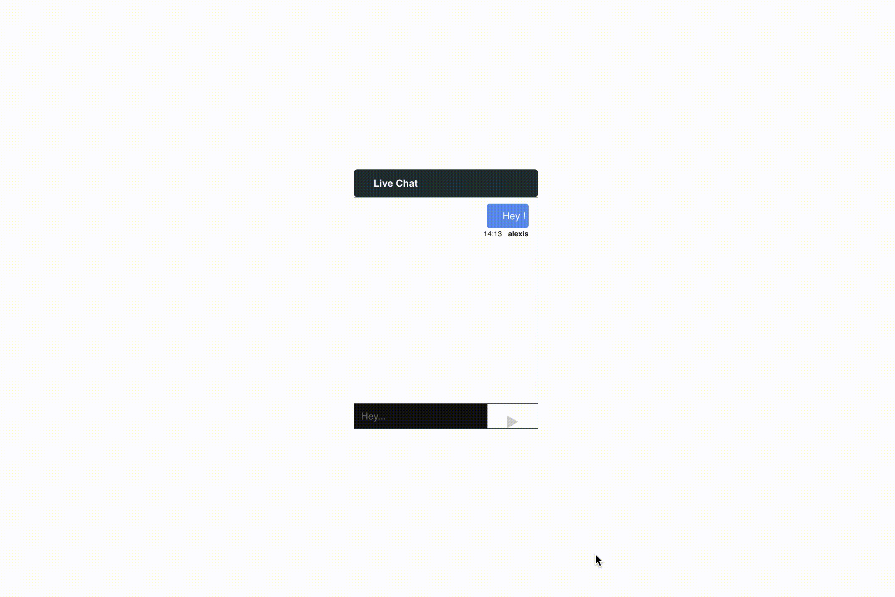

# Real-time Chat

Il s'agit d'une application de chat simple créée avec Socket.io. Elle permet aux utilisateurs d'échanger des messages en temps réel au sein de différentes salles de discussion. L'application dispose d'une interface utilisateur conviviale pour une communication fluide.

## Technologies utilisées

- React.js
- [Socket.io](https://socket.io/)
- Express.js

## install

1. Pour le client :
    Exécutez npm install dans le répertoire du client.
2. Pour le serveur :
    Exécutez également npm install dans le répertoire du serveur.
3. Pour lancer l'application :

    Côté client : exécutez npm run dev.  
    Côté serveur : exécutez node app.js.
4. Puis ouvrir deux pages pour discuter (avec vous-même 🥸).
## Demo
1. Pour rejoindre un chat, il faut un pseudo et un identifiant de salle (room ID).

   

   

3. Plus qu'à discuter !!!"

   

